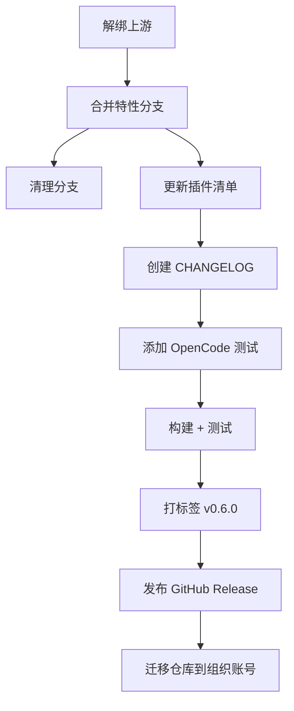

# Plan: cc-hud 独立维护执行计划

## 依赖顺序

## 执行步骤

### Step 1: 解绑上游
- 删除 `upstream` remote
- 确认与原作者仓库完全脱离

### Step 2: 合并特性分支
- `feat/opencode-quota` → `main`（fast-forward merge）
- `docs/cc-hud-extra-file-windows` 已包含在 feat 分支中，无需单独操作

### Step 3: 清理分支
- 删除本地特性分支：`feat/opencode-quota`、`docs/cc-hud-extra-file-windows`
- 删除远程特性分支：`origin/feat/opencode-quota`、`origin/docs/cc-hud-extra-file-windows`

### Step 4: 更新插件清单
- 修改 `.claude-plugin/plugin.json` 和 `marketplace.json` 中的 `owner` 和 `repository` 字段

### Step 5: 创建 CHANGELOG.md
- Keep a Changelog 格式
- 汇总 v0.1.0 ~ v0.5.1 历史 + v0.6.0 新变更

### Step 6: OpenCode 测试
- 为 `src/opencode.ts` 编写 `tests/opencode.test.ts`
- 覆盖：配额解析、错误降级、模型名美化

### Step 7: 构建 + 测试
- `npm run build` + `npm test`
- 确保全部通过

### Step 8: 版本发布 v0.6.0
- `npm version 0.6.0`
- `git push origin main --tags`

### Step 9: GitHub Release
- `gh release create v0.6.0` 引用 CHANGELOG

### Step 10 (未来): 仓库迁移
- 在 GitHub 创建组织
- 迁移 repo 到组织下
- 更新所有 remote URL
- 在 Claude Code 插件市场提交组织版审核

## 风险与缓解

| 风险 | 缓解 |
|------|------|
| 合并冲突 | feat 分支仅超前 4 commits，冲突概率低 |
| 上游后续更新 | 已解绑，不关注 |
| 市场审核不通过 | 先独立维护，等上架条件成熟再提交 |
| 组织迁移后断链 | 在旧 repo 加 README 跳转提示 |

## 验证检查点

- [Step 1] `git remote -v` 确认无 upstream
- [Step 3] `git branch -a` 确认只剩 `main`
- [Step 7] `npm test` 全部通过
- [Step 8] `git tag -l` 包含 v0.6.0
- [Step 9] GitHub 上 Release 可见
