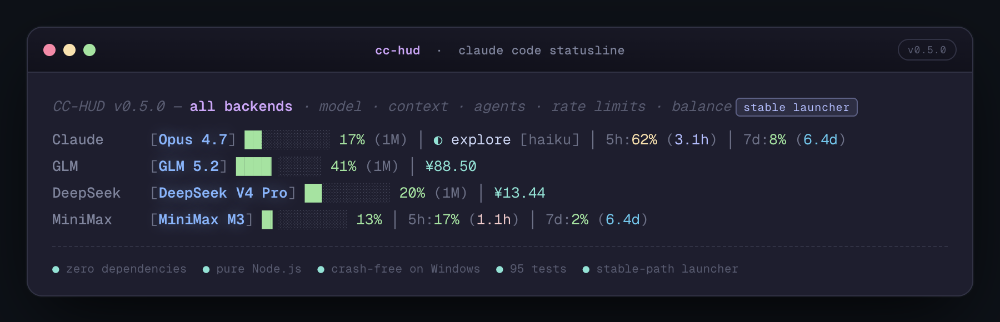

<p align="center">
  
</p>

<h1 align="center">CC-HUD</h1>

<p align="center">
  <strong>A compact, single-line statusline for <a href="https://claude.ai/claude-code">Claude Code</a></strong><br/>
  <sub>精简的 Claude Code 单行状态栏插件</sub>
</p>

<p align="center">
  <code>Model</code> &nbsp;&rarr;&nbsp; <code>Context</code> &nbsp;&rarr;&nbsp; <code>Agents</code> &nbsp;&rarr;&nbsp; <code>Rate Limits</code>
  <br/>
  <sub>everything you need, nothing you don't.</sub>
</p>

<p align="center">
  
</p>

<p align="center">
  <a href="#install"></a>
  &nbsp;
  
  &nbsp;
  = 18" />
  &nbsp;
  
</p>

<br/>

## Why CC-HUD?

<table>
<tr><td>

### The Problem

Claude Code's native installer bundles [Bun](https://bun.sh), which has a known memory allocator bug on **Windows** ([oven-sh/bun#25082](https://github.com/oven-sh/bun/issues/25082)), causing frequent `pas panic` crashes. Statusline plugins like [jarrodwatts/claude-hud](https://github.com/jarrodwatts/claude-hud) run **on every tick**, amplifying memory pressure and making crashes far more likely.

### The Solution

CC-HUD is a **crash-free alternative** — pure Node.js, zero dependencies, stateless per-call, ~60ms execution, 2s hard timeout. Designed to keep your status bar running without taking Claude Code down.

</td></tr>
</table>

## 为什么做 CC-HUD？

<table>
<tr><td>

### 问题

Claude Code 原生安装器内嵌 [Bun](https://bun.sh)，在 **Windows** 上存在已知内存分配器 bug（[oven-sh/bun#25082](https://github.com/oven-sh/bun/issues/25082)），频繁触发 `pas panic` 崩溃。而 [jarrodwatts/claude-hud](https://github.com/jarrodwatts/claude-hud) 等状态栏插件**每次 tick 都会执行**，加剧内存压力，使崩溃更加频繁。

### 解决方案

CC-HUD 是**不会崩溃的替代方案** — 纯 Node.js、零依赖、无状态调用、~60ms 执行、2s 硬超时。让状态栏稳定运行，不拖垮 Claude Code。

</td></tr>
</table>

> [!TIP]
> **Windows users:** Use `npm i -g @anthropic-ai/claude-code` instead of the native installer to avoid Bun crashes entirely.
>
> **Windows 用户：** 建议用 `npm i -g @anthropic-ai/claude-code` 代替原生安装器，彻底规避 Bun 崩溃。

<br/>

## Features

<table>
<tr>
  <td align="center" width="20%"><h3>█▌</h3><b>Context Bar</b><br/><sub>1/8-precision blocks<br/>80-level granularity</sub></td>
  <td align="center" width="20%"><h3>🎨</h3><b>Color</b><br/><sub><a href="https://github.com/catppuccin/catppuccin">Catppuccin Mocha</a><br/>4-stop gradient</sub></td>
  <td align="center" width="20%"><h3>◐</h3><b>Agents</b><br/><sub>Running subagents<br/>with type & model</sub></td>
  <td align="center" width="20%"><h3>%</h3><b>Rate Limits</b><br/><sub>5h / 7d usage<br/>Pro / Max</sub></td>
  <td align="center" width="20%"><h3>0</h3><b>Dependencies</b><br/><sub>Zero. Node.js<br/>built-ins only</sub></td>
</tr>
</table>

<br/>

## Install

Inside Claude Code, run 3 commands:

```
/plugin marketplace add WaterTian/cc-hud
/plugin install cc-hud
/cc-hud:setup
```

Restart Claude Code. **Done.**

<details>
<summary><b>Manual install</b></summary>
<br/>

```bash
git clone https://github.com/WaterTian/cc-hud.git
cd cc-hud && npm install && npm run build
```

Add to `~/.claude/settings.json`:

```json
{
  "statusLine": {
    "type": "command",
    "command": "node /path/to/cc-hud/dist/index.js",
    "padding": 2
  }
}
```

</details>

<br/>

## How It Works

```
Claude Code ─── stdin JSON ──→ cc-hud ──→ stdout ──→ status bar
             ↘ transcript JSONL (tail 64KB → active agents)
```

<table>
<tr>
  <td align="center"><b>Stateless</b><br/><sub>Fresh process per call<br/>zero memory leaks</sub></td>
  <td align="center"><b>Fast</b><br/><sub>~60ms execution<br/>within 300ms debounce</sub></td>
  <td align="center"><b>Safe</b><br/><sub>2s hard timeout<br/>all IO try-catch</sub></td>
</tr>
</table>

<br/>

## Development

```bash
npm run build      # compile
npm test           # 13 tests
```

<br/>

---

<p align="center">
  <sub>MIT License &copy; <a href="https://github.com/WaterTian">Water</a></sub>
</p>
