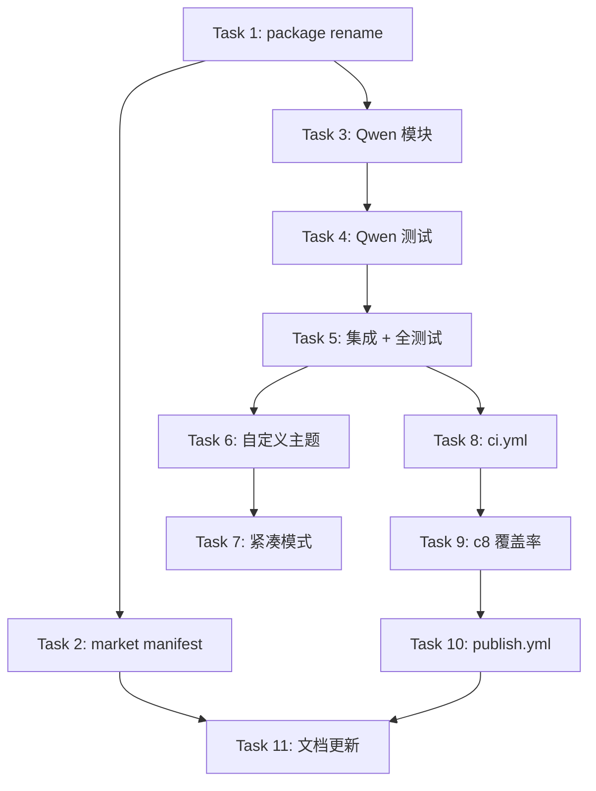

# Implementation Plan: cc-hud v2 — npm · Qwen · CI/CD · HUD 增强

## Overview

cc-hud 独立维护后的首个完整版本迭代。核心交付：npm scoped 包发布 → 通义千问后端 → HUD 自定义主题 → CI/CD 管线。

## 架构决策

| 决策 | 理由 |
|------|------|
| `@wyouwd1/cc-hud` scoped 包 | `cc-hud` 被原作者占用，scoped 包无需联系原作者转移 |
| Qwen 按 `glm.ts` 模式实现 | 余额采集模式与 GLM/DeepSeek 一致，复用现有 cache/timeout 逻辑 |
| Qwen 作为 "extra" 段（非 quota） | 通义千问的余额信息适合在 extra 段显示，不占用 rate_limits 位置 |
| 主题/紧凑模式通过 env 控制 | 保持零外部依赖，避免配置文件解析 |

## 依赖图



---

## 任务列表

### Phase 1: npm 发布

#### Task 1: 改包名为 `@wyouwd1/cc-hud` + npm publish

**Description:** 修改 `package.json` 中的 `name` 为 `@wyouwd1/cc-hud`，更新 `bin` 字段和版本号。执行 `npm publish --access public` 发布到 npm Registry。

**Acceptance criteria:**
- [ ] `package.json` 中 `name` 为 `@wyouwd1/cc-hud`
- [ ] `npm publish --access public` 成功
- [ ] `npm i -g @wyouwd1/cc-hud && npx @wyouwd1/cc-hud` 正常运行

**Verification:**
- [ ] `npm view @wyouwd1/cc-hud` 返回包信息
- [ ] `npm install -g @wyouwd1/cc-hud` 安装成功

**Dependencies:** 无（假设 npm 账号已注册）

**Files likely touched:**
- `package.json`
- `package-lock.json`

**Estimated scope:** XS

---

#### Task 2: 更新 Claude Code 市场 manifest + 安装文档

**Description:** 更新 `plugin.json` 和 `marketplace.json` 中的 owner、repository 信息。更新 README 中 npm 安装方式改为 `@wyouwd1/cc-hud`。Claude Code 市场提交审核。

**Acceptance criteria:**
- [ ] `plugin.json` owner → `wyouwd1`，repository → `wyouwd1/cc-hud`
- [ ] `marketplace.json` owner → `wyouwd1`
- [ ] README npm 安装命令更新

**Verification:**
- [ ] 阅读 plugin.json / marketplace.json 确认

**Dependencies:** Task 1

**Files likely touched:**
- `.claude-plugin/plugin.json`
- `.claude-plugin/marketplace.json`
- `README.md`

**Estimated scope:** XS

---

#### Checkpoint: Phase 1
- [ ] `@wyouwd1/cc-hud` 在 npm 上可见
- [ ] 市场 manifest 已更新
- [ ] 确认后继续 Phase 2

---

### Phase 2: 通义千问 (Qwen) 后端

#### Task 3: 实现 `src/qwen.ts` — 通义千问余额采集

**Description:** 参照 `glm.ts` 模式，创建 Qwen 后端余额采集模块。检测方式：`ANTHROPIC_BASE_URL` 包含 `qwen`。调用通义千问余额 API，提取余额信息并缓存。

**关键设计：**
- `isQwen()`: 检测 `ANTHROPIC_BASE_URL` 含 `qwen`
- `fetchBalance()`: 调用 `https://dashscope.aliyuncs.com/api/v1/...` 获取余额
- 2s 超时 + 5 分钟缓存
- 返回格式化余额字符串（如 `¥88.50`）

**Acceptance criteria:**
- [ ] `src/qwen.ts` 存在，导出 `getQwenBalance(): Promise<string | null>`
- [ ] 非 qwen 环境（ANTHROPIC_BASE_URL 不含 qwen）返回 null
- [ ] API 返回余额时正确格式化
- [ ] 错误/超时时返回 null

**Verification:**
- [ ] `tsc` 编译无报错
- [ ] 模块结构与其他后端一致

**Dependencies:** 无（独立模块）

**Files likely touched:**
- `src/qwen.ts`

**Estimated scope:** S

---

#### Task 4: 编写 `tests/qwen.test.ts`

**Description:** 参照 `tests/mmx.test.ts` / `tests/glm.test.ts` 模式，为 Qwen 模块编写完整测试。

**测试覆盖：**
- **Isolation**: 非 qwen 的 ANTHROPIC_BASE_URL 返回 null，不发 fetch
- **解析**: 真实形状的 JSON 响应提取余额
- **错误降级**: HTTP 错误、超时、解析失败返回 null
- **缓存**: 5 分钟缓存命中、stale cache 回退

**Acceptance criteria:**
- [ ] `tests/qwen.test.ts` 存在
- [ ] 覆盖 isolation / 解析 / 错误 / 缓存 4 个维度
- [ ] `node --test tests/qwen.test.ts` 全部通过

**Verification:**
- [ ] `node --test tests/qwen.test.ts` 全通过

**Dependencies:** Task 3（需要 `src/qwen.ts` 存在）

**Files likely touched:**
- `tests/qwen.test.ts`

**Estimated scope:** M (~120 行)

---

#### Task 5: 集成 Qwen 到 `src/index.ts` + 全测试

**Description:** 在 `src/index.ts` 中将 Qwen 余额加入到 extra 段优先链中。优先级：`CC_HUD_EXTRA_FILE > Qwen 余额 > DeepSeek 余额 > GLM 余额`。运行全部测试确认无回归。

**Integration:**
```typescript
// extra segment 链中插入 qwen
(async () => readExtraFile() ?? (await getQwenBalance()) ?? (await getExtra()) ?? (await getGlmBalance()))(),
```

**Acceptance criteria:**
- [ ] Qwen 余额出现在 extra 段
- [ ] 其他后端不受影响（still returns null when not qwen）
- [ ] `npm test` 全部通过

**Verification:**
- [ ] `npm run build && npm test` 全通过

**Dependencies:** Task 3 + Task 4

**Files likely touched:**
- `src/index.ts`
- `tests/qwen.test.ts`

**Estimated scope:** S

---

#### Checkpoint: Phase 2
- [ ] Qwen 后端完成
- [ ] 全部测试通过
- [ ] 确认后继续 Phase 3

---

### Phase 3: HUD 功能增强

#### Task 6: 自定义颜色主题（`CC_HUD_THEME`）

**Description:** 在 `src/render.ts` 中支持通过 `CC_HUD_THEME` 环境变量切换配色方案。默认 Catppuccin Mocha，新增 Dracula 和 Nord 主题。

**主题定义：**
```
Catppuccin (默认): 绿151/黄223/桃216/红211
Dracula:           绿84/黄228/橙215/红210
Nord:              蓝109/黄221/橙208/红167
```

**Acceptance criteria:**
- [ ] `CC_HUD_THEME=catppuccin` → 当前配色不变
- [ ] `CC_HUD_THEME=dracula` → Dracula 配色
- [ ] `CC_HUD_THEME=nord` → Nord 配色
- [ ] 无效值或不设置 → 默认 Catppuccin

**Verification:**
- [ ] `CC_HUD_THEME=dracula node dist/index.js < tests/fixtures/stdin.json` 颜色不同
- [ ] 现有测试全部通过（默认主题不变）

**Dependencies:** 无

**Files likely touched:**
- `src/render.ts`
- `tests/render.test.ts`（主题测试）

**Estimated scope:** M

---

#### Task 7: 紧凑模式（`CC_HUD_COMPACT=1`）

**Description:** 在 `src/render.ts` 中支持 `CC_HUD_COMPACT=1` 隐藏可选字段。紧凑模式下仅显示：模型名 + 上下文进度条。隐藏：agent 段、速率限制段、extra 段。

**Acceptance criteria:**
- [ ] `CC_HUD_COMPACT=1` → 仅显示模型名 + 进度条
- [ ] `CC_HUD_COMPACT` 未设置 → 正常显示所有段
- [ ] 紧凑模式下 agent 信息不丢失（只是不显示）

**Verification:**
- [ ] `CC_HUD_COMPACT=1 node dist/index.js < fixture` 输出更短
- [ ] 现有 render 测试全部通过

**Dependencies:** 无

**Files likely touched:**
- `src/render.ts`
- `src/types.ts`（如果需要扩展 RenderData）
- `tests/render.test.ts`

**Estimated scope:** S

---

#### Checkpoint: Phase 3
- [ ] 两个主题切换正常
- [ ] 紧凑模式正常
- [ ] 全部测试通过
- [ ] 确认后继续 Phase 4

---

### Phase 4: CI/CD 管线

#### Task 8: 创建 GitHub Actions CI (`ci.yml`)

**Description:** 创建 `.github/workflows/ci.yml`，在 push 和 PR 到 main 时自动运行：`tsc` 编译检查 + `node --test` 全部测试。

**Acceptance criteria:**
- [ ] `.github/workflows/ci.yml` 存在
- [ ] push 到 main 触发 CI
- [ ] PR 到 main 触发 CI
- [ ] CI 运行 tsc + test

**Verification:**
- [ ] push 后 GitHub Actions 页面可见运行记录

**Dependencies:** 无

**Files likely touched:**
- `.github/workflows/ci.yml`

**Estimated scope:** S

---

#### Task 9: 配置 c8 覆盖率

**Description:** 在 `package.json` 中添加 c8 覆盖率脚本，CI 中集成覆盖率报告。设置 `npm run coverage` 命令。

**Acceptance criteria:**
- [ ] `npx c8 npm test` 输出覆盖率报告
- [ ] 覆盖率 ≥ 80%

**Verification:**
- [ ] `npx c8 npm test` 运行成功

**Dependencies:** Task 8

**Files likely touched:**
- `package.json`
- `.github/workflows/ci.yml`

**Estimated scope:** XS

---

#### Task 10: 创建 GitHub Actions 发布流水线 (`publish.yml`)

**Description:** 创建 `.github/workflows/publish.yml`，在 tag push（如 `v0.6.1`）时自动执行：tsc 编译 → npm test → npm publish → GitHub Release。

**Acceptance criteria:**
- [ ] `.github/workflows/publish.yml` 存在
- [ ] tag push 时自动触发
- [ ] 自动执行 `npm publish`

**Verification:**
- [ ] 发布 tag 后 GitHub Actions 页面可见

**Dependencies:** Task 8 + Task 9

**Files likely touched:**
- `.github/workflows/publish.yml`

**Estimated scope:** S

---

#### Checkpoint: Phase 4
- [ ] CI push/PR 自动运行
- [ ] c8 覆盖率 ≥ 80%
- [ ] publish.yml 就绪

---

### Phase 5: 文档整理

#### Task 11: 统一 OpenCode Go 命名 + README 更新

**Description:** 将代码注释、文档中的 OpenCode 统一改为 OpenCode Go。更新 README 补充 Qwen 后端、主题、紧凑模式的说明。更新测试数量。

**Acceptance criteria:**
- [ ] README 中 OpenCode → OpenCode Go
- [ ] README 包含 Qwen 后端信息
- [ ] README 包含主题/紧凑模式说明
- [ ] 测试数量更新

**Verification:**
- [ ] 阅读 README 确认

**Dependencies:** Task 5 + Task 7

**Files likely touched:**
- `README.md`
- `src/opencode.ts`（注释）
- `CHANGELOG.md`

**Estimated scope:** S

---

## 风险与缓解

| 风险 | 影响 | 缓解 |
|------|------|------|
| 通义千问 API 文档与实际有出入 | Medium | opencode.ts 已展示 HTML parsing 模式；余额 API 用类似 GLM 的 JSON 提取 |
| npm publish 时包名冲突 | Low | scoped 包 `@wyouwd1/cc-hud` 由 namespace 隔离 |
| CI token/secret 管理 | Low | 使用 GitHub Secrets 存储 npm token |

## 开放问题

- 通义千问余额 API 端点需确认（`dashscope.aliyuncs.com` 或其他）
- npm 账号注册状态需确认（如已注册可省略注册步骤）
- 发布时间：所有任务完成后统一 `npm version` + `npm publish`
