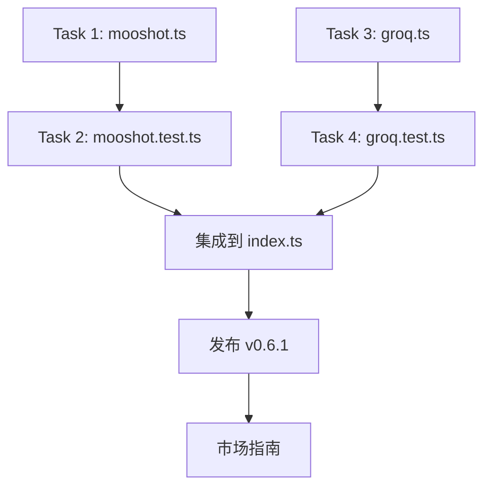

# Implementation Plan: cc-hud v0.6.1 — Moonshot · Groq · 发布 · 市场上架

## Overview

新增两个后端模块（Moonshot、Groq），发布 v0.6.1，输出市场上架操作指南。

## 架构决策

| 决策 | 理由 |
|------|------|
| Moonshot 按 `qwen.ts` 模式 | 余额采集模式一致，复用 cache/timeout 逻辑 |
| Groq 按 `qwen.ts` 模式 | 同上，端点可配置 |
| 两者插入 extra 段链 | `readExtraFile > Qwen > Moonshot > Groq > DeepSeek > GLM` |
| 发布通过 publish.yml | 管线已就绪，tag push 即自动发布 |

## 依赖图

## 任务列表

### Task 1: 实现 `src/moonshot.ts`

**Description:** 参照 `qwen.ts` 模式创建 Moonshot 余额采集模块。

- 检测：`ANTHROPIC_BASE_URL` 含 `moonshot`
- 端点：`https://api.moonshot.cn/v1/billing/balance`
- 灵活解析：支持 balance / data.balance / remainingBalance 等不同响应结构
- 2s 超时 + 5 分钟缓存
- 返回：`¥XX.XX` 格式或 null

**Acceptance:**
- [ ] `src/moonshot.ts` 存在，导出 `getMoonshotBalance(): Promise<string | null>`
- [ ] 非 moonshot 环境返回 null
- [ ] tsc 编译无报错

**Verify:** `npm run build`
**Scope:** S (1 file)

---

### Task 2: 编写 `tests/moonshot.test.ts`

**Description:** 覆盖 4 个维度：isolation / 解析 / 错误 / 缓存。

**Acceptance:**
- [ ] `node --test tests/moonshot.test.ts` 全部通过
- [ ] 覆盖 4 个维度

**Verify:** `node --test tests/moonshot.test.ts`
**Scope:** M (~120 行)

---

### Task 3: 实现 `src/groq.ts`

**Description:** 参照 `qwen.ts` 模式创建 Groq 用量采集模块。

- 检测：`ANTHROPIC_BASE_URL` 含 `groq`
- 端点：`https://api.groq.com/v1/user/usage`
- 灵活解析
- 2s 超时 + 5 分钟缓存
- 返回：格式化字符串或 null

**Acceptance:**
- [ ] `src/groq.ts` 存在，导出 `getGroqUsage(): Promise<string | null>`
- [ ] 非 groq 环境返回 null
- [ ] tsc 编译无报错

**Verify:** `npm run build`
**Scope:** S (1 file)

---

### Task 4: 编写 `tests/groq.test.ts`

**Description:** 覆盖 4 个维度：isolation / 解析 / 错误 / 缓存。

**Acceptance:**
- [ ] `node --test tests/groq.test.ts` 全部通过

**Verify:** `node --test tests/groq.test.ts`
**Scope:** M (~120 行)

---

### Task 5: 集成到 `src/index.ts` + 全测试

**Description:** 在 index.ts 中导入两个新模块，接入 extra 段链。优先级：`readExtraFile > Qwen > Moonshot > Groq > DeepSeek > GLM`

**Acceptance:**
- [ ] `npm test` 全部通过
- [ ] Moonshot 和 Groq 的 isolation 测试确认不干扰其他后端

**Verify:** `npm test`
**Scope:** S (1 file)

---

### Task 6: 发布 v0.6.1

**Description:** 更新 CHANGELOG（将 Unreleased 移入 v0.6.1），npm version bump，push tag 触发 publish.yml。

**Acceptance:**
- [ ] CHANGELOG 中 v0.6.1 入口正确
- [ ] `git tag -l` 包含 v0.6.1
- [ ] GitHub Actions publish.yml 自动运行

**Verify:** `git push origin main --tags` 后检查 Actions 页面
**Scope:** XS

---

### Task 7: 市场上架指南 `docs/marketplace-submission.md`

**Description:** 编写操作指南文档，用户按步骤提交 Claude Code 插件市场。

**Acceptance:**
- [ ] `docs/marketplace-submission.md` 存在
- [ ] 包含完整的操作步骤
- [ ] 包含验证方式

**Verify:** 阅读文档确认完整性
**Scope:** XS

---

## 风险与缓解

| 风险 | 影响 | 缓解 |
|------|------|------|
| Moonshot/Groq API 端点不对 | Low | 静默返回 null，不影响其他功能 |
| publish.yml 因 npm token 失效 | Medium | 需确保 `~/.npmrc` 中 token 有效 |
| 市场指南过时 | Low | 指南标明"基于当前 UI，如有变化请参考官方文档" |
