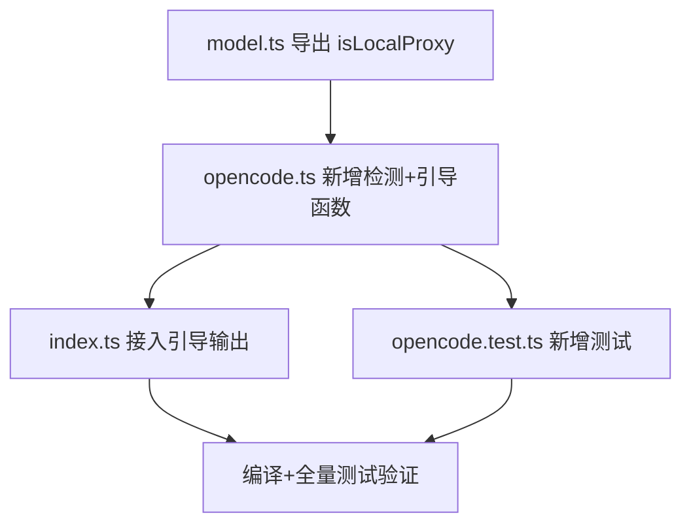

# Implementation Plan: OpenCode Go 自动识别与配置引导

## 概述

当 `ANTHROPIC_BASE_URL` 指向 `127.0.0.1`（OpenCode Go 本地代理）且用户未配置 `OPENCODE_AUTH` 时，cc-hud 当前完全静默。用户不知道需要额外配置配额凭证。

**解决**：自动检测本地代理特征，在状态栏 extra 段显示引导提示 + 输出独立指引行供 AI 读取，引导用户通过 `https://opencode.ai/go?ref=TN4ZD3A7YH` 获取 auth cookie。

## 当前已可复用的代码

| 函数/模式 | 位置 | 复用方式 |
|-----------|------|---------|
| `isLocalProxy()` | `src/model.ts:42-44` | 直接 `export` 后移植——已检查 `127.0.0.1` + `localhost` |
| `env` 测试隔离模式 | `tests/opencode.test.ts` | `beforeEach`/`afterEach` 保存恢复 `process.env` |
| 动态 import 测试模式 | `tests/opencode.test.ts:7` | `import('../dist/opencode.js')` 导入编译产物 |
| 缓存模块 | `src/cache.ts` | `readCached`/`writeCached` 复用 — 但指引提示无需缓存（同步判断） |
| `npm run build` | `package.json` | `tsc` 编译 TS→JS |
| `npm test` | `package.json` | `build && node --test` — 测试目标为 `dist/` |

## 依赖图



T1→T2 串行，T3/T4 可并行，T5 收口验证。

## 任务列表

---

### Phase 1: 核心逻辑

#### Task 1: 导出 `src/model.ts` 中的 `isLocalProxy()` 函数

**涉及的变更文件:** `src/model.ts`

**动机说明：** `model.ts` 的 `isLocalProxy()` 与 opencode.ts 所需功能完全一致（检查 `ANTHROPIC_BASE_URL` 是否含 `127.0.0.1`/`localhost`）。只需加 `export` 关键字即可复用，避免重复逻辑。

**改动点：**
1. 将 `function isLocalProxy()` 改为 `export function isLocalProxy()`
2. 无其他变更

**改动量:** 1 行（加 `export`）
**风险:** 无（仅扩大可见性，不影响已有逻辑）

**验收标准:**
- [ ] `isLocalProxy()` 可从 `model.ts` 导入
- [ ] 导出后 `shortModelName()` 内部调用不变（同文件内可见）
- [ ] `tsc` 编译无错误

---

#### Task 2: 在 `src/opencode.ts` 中新增检测与引导函数

**涉及的变更文件:** `src/opencode.ts`

**新增 import：**
```typescript
import { isLocalProxy } from './model.js';
```

**具体改动：**

**A. 新增内部辅助函数（替换原有 `isOpenCode`）：**

| 函数 | 可见性 | 作用 |
|------|--------|------|
| `hasCredentials()` | 内部 | `!!process.env.OPENCODE_AUTH` |
| `isHintSilenced()` | `export` | `process.env.CC_HUD_SKIP_OC_HINT === '1'` |

**B. 增强 `isOpenCode()`：**

```typescript
// 旧: return !!process.env.OPENCODE_AUTH;
// 新:
export function isOpenCode(): boolean {
  return hasCredentials() || isLocalProxy();
}
```

**C. 新增核心判断函数：**

```typescript
/** 是否需要显示引导提示（本地代理 + 无凭证 + 未静音） */
export function needsGuidance(): boolean {
  return isLocalProxy() && !hasCredentials() && !isHintSilenced();
}
```

**D. 新增输出函数：**

```typescript
/** 获取 extra 段引导文字 */
export function getOpenCodeHint(): string | null {
  if (!needsGuidance()) return null;
  return 'OC need auth → opencode.ai/go?ref=TN4ZD3A7YH';
}

/** 获取独立指引行（多行纯文本） */
export function getOpenCodeGuidanceLine(): string | null {
  if (!needsGuidance()) return null;
  return [
    '[cc-hud] ⚠ OpenCode Go 本地代理已检测到，但未配置配额凭证。',
    '  配置方式：访问 https://opencode.ai/go?ref=TN4ZD3A7YH ，',
    '  从浏览器开发者工具 Network 标签页复制 cURL 请求，',
    '  提取 cookie 中的 auth 值设置为 OPENCODE_AUTH。',
    '  设置 CC_HUD_SKIP_OC_HINT=1 可关闭此提示。',
  ].join('\n');
}
```

**注意：** 不需要给 `isOpenCode()` 增加 CC_HUD_SKIP_OC_HINT 的感知 — `isOpenCode()` 的作用是决定是否尝试抓取配额（`getOpenCodeQuota()` 的入口）。引导提示只是信息告知，不影响配额抓取行为。

**改动量:** ~30 行新增，~3 行修改
**涉及模块间的引用:** `opencode.ts` → `model.ts`（单向，无循环）

**验收标准:**
- [ ] `hasCredentials()`: OPENCODE_AUTH 存在时返回 true
- [ ] `isHintSilenced()`: CC_HUD_SKIP_OC_HINT=1 时返回 true
- [ ] `isOpenCode()`: 有凭证或本地代理时返回 true
- [ ] `needsGuidance()`: 仅本地代理 + 无凭证 + 未静音 时返回 true
- [ ] `getOpenCodeHint()`: guidance 状态时返回字符串，否则 null
- [ ] `getOpenCodeGuidanceLine()`: guidance 状态时返回多行文本，否则 null
- [ ] 现有 `getOpenCodeQuota()` 行为通过 `isOpenCode()` 的增强间接覆盖本地代理场景

**组合状态真值表（验证核心逻辑）：**

| 127.0.0.1 | OPENCODE_AUTH | CC_HUD_SKIP_OC_HINT | isOpenCode | needsGuidance |
|-----------|---------------|---------------------|------------|---------------|
| ❌        | ❌            | ❌                  | ❌         | ❌            |
| ❌        | ✅            | ❌                  | ✅         | ❌            |
| ✅        | ❌            | ❌                  | ✅         | ✅            |
| ✅        | ✅            | ❌                  | ✅         | ❌            |
| ✅        | ❌            | ✅                  | ✅         | ❌            |
| ✅        | ✅            | ✅                  | ✅         | ❌            |

---

### Phase 2: 集成

#### Task 3: 在 `src/index.ts` 中接入引导输出

**涉及的变更文件:** `src/index.ts`

**改动点：**

1. **新增 import：**
```typescript
import { getOpenCodeQuota, getOpenCodeHint, getOpenCodeGuidanceLine } from './opencode.js';
```

2. **在 `main()` 中，获取 extra 段之前：**
```typescript
// 同步获取引导提示（纯逻辑，无网络 IO）
const ocHint = getOpenCodeHint();

// 输出独立指引行供 AI 读取
const guidanceLine = getOpenCodeGuidanceLine();
if (guidanceLine) {
  // stdout 输出，状态栏行将是最后的 console.log
  console.log(guidanceLine);
}
```

3. **调整 extra 段 pipeline：**
```typescript
const getExtraSegment = async (): Promise<string | null> =>
  readExtraFile()
    ?? ocHint  // <-- 引导提示优先于其他后端余额
    ?? await getQwenBalance()
    ?? await getMoonshotBalance()
    ?? await getGroqUsage()
    ?? await getExtra()
    ?? await getGlmBalance();
```

**不修改的部分：**
- `getOpenCodeQuota()` 的调用不变（当本地代理 + 有凭证时照常抓取配额）
- `renderData` 构造不变（extra 字段接管 hint 文本）
- `render.ts` 不变（extra 段渲染逻辑不涉及）

**改动量:** ~8 行新增
**影响范围:** 仅控制台输出多一行（引导文本）+ extra 段在特定状态下显示提示

**验收标准:**
- [ ] 状态 C（127.0.0.1 + 无凭证）时，stdout 首行输出指引文本
- [ ] 状态 C 时，状态栏 extra 段显示 "OC need auth → opencode.ai/go?ref=TN4ZD3A7YH"
- [ ] 状态 A/B/D/E 时，行为零变化
- [ ] 指引行出现在状态栏行之前，不影响状态栏解析
- [ ] 超时机制不变（6s 硬超时不受影响）

---

### Phase 3: 测试

#### Task 4: 在 `tests/opencode.test.ts` 中新增检测与引导测试

**涉及的变更文件:** `tests/opencode.test.ts`

**测试策略：**
- 沿用现有 `beforeEach`/`afterEach` 模式保存恢复全局 env
- 使用 `import('../dist/opencode.js')` 动态导入编译产物
- 新增 `describe('auto-detection & guidance')` 块

**测试用例：**

```
describe('auto-detection & guidance', () => {
  describe('isOpenCode (enhanced)', () => {
    it('returns true when ANTHROPIC_BASE_URL contains 127.0.0.1')
    it('returns true when OPENCODE_AUTH is set (even without 127.0.0.1)')
    it('returns false when neither 127.0.0.1 nor OPENCODE_AUTH')
    it('returns true when both 127.0.0.1 and OPENCODE_AUTH')
  })

  describe('isHintSilenced', () => {
    it('returns true when CC_HUD_SKIP_OC_HINT=1')
    it('returns false when CC_HUD_SKIP_OC_HINT is unset')
    it('returns false when CC_HUD_SKIP_OC_HINT=0')
  })

  describe('needsGuidance', () => {
    it('returns true when 127.0.0.1 + no auth + not silenced')
    it('returns false when 127.0.0.1 but has credentials')
    it('returns false when 127.0.0.1 but silenced')
    it('returns false when not 127.0.0.1 (even without auth)')
    it('returns false when 127.0.0.1 + no auth + silenced = 1')
  })

  describe('getOpenCodeHint', () => {
    it('returns string when needsGuidance is true')
    it('returns null when needsGuidance is false')
    it('contains "OC" and "go?ref=TN4ZD3A7YH" in the hint text')
  })

  describe('getOpenCodeGuidanceLine', () => {
    it('returns string when needsGuidance is true')
    it('returns null when needsGuidance is false')
    it('contains opencode.ai/go?ref=TN4ZD3A7YH in the guidance')
    it('has multiple lines')
  })
})
```

**Env mock 策略：**
```typescript
// 模拟本地代理
process.env.ANTHROPIC_BASE_URL = 'http://127.0.0.1:15721';

// 模拟凭证
process.env.OPENCODE_AUTH = 'test-auth';

// 模拟静音
process.env.CC_HUD_SKIP_OC_HINT = '1';
```

**改动量:** ~80 行新增
**主要风险:** env 是全局可变状态，`beforeEach` 需保存恢复所有相关 env 变量

**验收标准:**
- [ ] 所有组合状态覆盖（见真值表，5 种组合全部测试）
- [ ] 所有新测试通过
- [ ] 现有 opencode 测试不受影响（env 完全隔离）
- [ ] 无 TypeScript 编译错误

---

### Phase 4: 验证

#### Task 5: 编译 + 全量测试

**涉及的变更文件:** 无

**命令:** `npm test`

**验证点：**
- `tsc` 无类型/编译错误
- 测试套件全部通过（含现有 29 个 it + 新增 ~15 个 it）
- 全部测试名称打印输出，无 skip/fail

**验收标准:**
- [ ] 退出码 0
- [ ] 所有测试通过
- [ ] 无 TypeScript 编译错误

---

## 风险与缓解

| 风险 | 影响 | 缓解 |
|------|------|------|
| `isLocalProxy()` 被两个模块引用，未来修改语义需同步 | 两处行为不一致 | 单点定义在 `model.ts`，`opencode.ts` 导入引用 |
| 独立指引行输出在 stdout，Claude Code 可能误解析为状态栏 | 状态栏显示异常 | 指引行先输出，状态栏在最后的 `console.log` — Claude Code 取最后一行解析 |
| env 变量测试间泄漏 | 测试不稳定 | `beforeEach` 完整保存/恢复影响范围内的所有 env |
| 用户使用 `localhost` 而非 `127.0.0.1` | 触发检测 | `model.ts` 的 `isLocalProxy()` 已包含 `localhost` — 这是预期行为 |

## 开放问题

| 问题 | 状态 |
|------|------|
| 独立指引行每条新对话都输出一遍？ | **已定**：静音前每次都输出，因为每次新会话都是"第一次" |
| 指引行格式是否需要调整以便 Claude Code 更好识别？ | **待实现验证**：先采用 `[cc-hud] ⚠` 前缀格式，运行后观察效果 |
| 检测到本地代理但用户否认是 OpenCode Go？ | **已定**：设置 `CC_HUD_SKIP_OC_HINT=1` 静音 |
