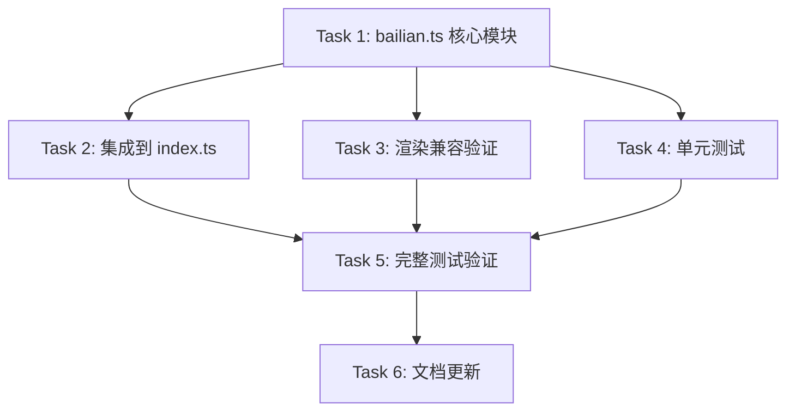

# Implementation Plan: 阿里云百炼 Coding Plan 额度适配

## 概述

为 cc-hud 新增阿里云百炼 Coding Plan 套餐的 3 档额度采集与显示，类似 opencode.ts 的模式。

## API 数据结构（已通过 curl 验证）

```json
{
  "code": "200",
  "data": {
    "DataV2": {
      "data": {
        "data": {
          "codingPlanInstanceInfos": [{
            "instanceId": "sfm_codingplan_public_cn-xxx",
            "instanceName": "Coding Plan Pro",
            "instanceType": "pro",
            "chargeType": "MONTH",
            "remainingDays": 6,
            "status": "VALID",
            "autoRenewFlag": true,
            "codingPlanQuotaInfo": {
              "per5HourUsedQuota": 0,
              "per5HourTotalQuota": 6000,
              "per5HourQuotaNextRefreshTime": 1783064808000,

              "perWeekUsedQuota": 258,
              "perWeekTotalQuota": 45000,
              "perWeekQuotaNextRefreshTime": 1783267200000,

              "perBillMonthUsedQuota": 2643,
              "perBillMonthTotalQuota": 90000,
              "perBillMonthQuotaNextRefreshTime": 1783612800000
            }
          }]
        }
      }
    }
  }
}
```

## 3 档额度映射

| 档位 | OpenCode 对应 | Bailian 字段 | 说明 |
|------|---------------|-------------|------|
| 5小时 | rollingPercent/ResetsAt | per5Hour | 每5小时滚动刷新 |
| 每周 | weeklyPercent/ResetsAt | perWeek | 每周刷新 |
| 每月 | monthlyPercent/ResetsAt | perBillMonth | 账单月刷新 |

## 环境变量

| 变量 | 说明 | 必须 |
|------|------|------|
| `CC_HUD_BAILIAN_COOKIE` | 完整阿里云登录 Cookie 字符串 | 是 |
| `CC_HUD_BAILIAN_SEC_TOKEN` | sec_token | 是 |
| `CC_HUD_BAILIAN_REGION` | 区域，默认 `cn-beijing` | 否 |
| `ANTHROPIC_AUTH_TOKEN` | 可选，用于检测是否配置了百炼后端 | 否 |

**检测条件**: `CC_HUD_BAILIAN_COOKIE` 存在时激活（类似 opencode.ts 的 `OPENCODE_AUTH`）。

## 任务列表

---

### Phase 1: 核心模块

#### Task 1: 新建 `src/bailian.ts`

**Description:** 编写百炼 Coding Plan 额度采集模块，遵循 mmx.ts / opencode.ts 风格。

**类型定义:**
```typescript
export interface BailianQuota {
  rollingPercent: number;    // 5h 用量百分比
  rollingResetsAt: number;   // 5h 重置时间戳
  weeklyPercent: number;     // 每周用量百分比
  weeklyResetsAt: number;    // 每周重置时间戳
  monthlyPercent: number;    // 月用量百分比
  monthlyResetsAt: number;   // 月重置时间戳
}
```

**函数设计:**

| 函数 | 可见性 | 职责 |
|------|--------|------|
| `cookie()` | 内部 | 读取 `CC_HUD_BAILIAN_COOKIE` |
| `secToken()` | 内部 | 读取 `CC_HUD_BAILIAN_SEC_TOKEN` |
| `region()` | 内部 | 读取 `CC_HUD_BAILIAN_REGION`，默认 `cn-beijing` |
| `isBailian()` | 内部 | 检测 `CC_HUD_BAILIAN_COOKIE` 是否存在 |
| `fetchQuota()` | 内部 | POST 调用 console API，返回解析后的配额 |
| `aggregatePlan(data)` | 内部 | 从 API 响应中提取 3 档额度，计算百分比 |
| `getBailianQuota()` | 导出 | 先读缓存，命中返回；未命中 fetch |

**缓存:**
- 缓存键: `bailian-quota`
- TTL: `5 * 60 * 1000`（与 mmx.ts 一致）
- 结构: `{ payload: BailianQuota, ts: number }`

**代码结构**（参考 opencode.ts ~100 行、mmx.ts ~70 行，预计 ~80 行）:

```typescript
import { readCached, writeCached, fetchWithTimeout, TTL } from './cache.js';

const HOST = 'https://bailian-cs.console.aliyun.com/data/api.json';

export interface BailianQuota { ... }

function isBailian(): boolean {
  return !!process.env.CC_HUD_BAILIAN_COOKIE;
}

function cookie(): string { return process.env.CC_HUD_BAILIAN_COOKIE!; }
function secToken(): string | null { return process.env.CC_HUD_BAILIAN_SEC_TOKEN ?? null; }
function region(): string { return process.env.CC_HUD_BAILIAN_REGION ?? 'cn-beijing'; }

function aggregatePlan(info: CodingPlanQuotaInfo): BailianQuota {
  const now = Date.now();
  return {
    rollingPercent: Math.round((info.per5HourUsedQuota / info.per5HourTotalQuota) * 100),
    rollingResetsAt: info.per5HourQuotaNextRefreshTime,
    weeklyPercent: Math.round((info.perWeekUsedQuota / info.perWeekTotalQuota) * 100),
    weeklyResetsAt: info.perWeekQuotaNextRefreshTime,
    monthlyPercent: Math.round((info.perBillMonthUsedQuota / info.perBillMonthTotalQuota) * 100),
    monthlyResetsAt: info.perBillMonthQuotaNextRefreshTime,
  };
}

async function fetchQuota(): Promise<BailianQuota | null> { ... }

export async function getBailianQuota(): Promise<BailianQuota | null> { ... }
```

**Acceptance criteria:**
- [ ] `isBailian()` 检测 `CC_HUD_BAILIAN_COOKIE` 存在时返回 true
- [ ] `aggregatePlan()` 正确计算 3 档百分比
- [ ] `fetchQuota()` 成功调用 console API 并返回结构化数据
- [ ] 未设置 Cookie 时静默返回 null
- [ ] 网络错误时返回过期缓存 / null

**Files touched:**
- `src/bailian.ts`（新增）

**Estimated scope:** M (~80 行)

---

### Phase 2: 集成与渲染

#### Task 2: 集成到 `src/index.ts`

**Description:** 将 bailian 导入并在 `Promise.all` 中并行获取，映射到 `RenderData`。

**改动:**

1. 顶部导入：`import { getBailianQuota, type BailianQuota } from './bailian.js';`
2. `Promise.all` 中新增 `getBailianQuota()`
3. 优先级链：
   - `fiveHourPercent`: Claude 原生 > OpenCode > MiniMax > **百炼**
   - `sevenDayPercent`: Claude 原生 > OpenCode > MiniMax > **百炼**
   - `monthlyPercent`: OpenCode > **百炼**

```typescript
const [ocQuota, mmQuota, blQuota, extra] = await Promise.all([
  getOpenCodeQuota(),
  getMmxQuota(),
  getBailianQuota(),  // 新增
  getExtraSegment(),
]);

fiveHourPercent: data.rate_limits?.five_hour?.used_percentage
  ?? ocQuota?.rollingPercent ?? mmQuota?.fiveHourUsedPct ?? blQuota?.rollingPercent ?? null,
sevenDayPercent: data.rate_limits?.seven_day?.used_percentage
  ?? ocQuota?.weeklyPercent ?? mmQuota?.sevenDayUsedPct ?? blQuota?.weeklyPercent ?? null,
// 月额度: OpenCode 优先，百炼次之
monthlyPercent: ocQuota?.monthlyPercent ?? blQuota?.monthlyPercent ?? null,
monthlyResetsAt: ocQuota?.monthlyResetsAt ?? blQuota?.monthlyResetsAt ?? null,
```

**Acceptance criteria:**
- [ ] `npm run build` 通过
- [ ] 百炼数据显示在 `5h` / `7d` / `mo` 对应的位置
- [ ] 未配置百炼时不影响其他后端
- [ ] 百炼数据优先级正确（低于 OpenCode 和 MiniMax）

**Files touched:**
- `src/index.ts`

**Estimated scope:** XS（~10 行改动）

---

#### Task 3: 渲染倒计时兼容

**Description:** 验证 `render.ts` 的 `formatCountdown` 函数对百炼的 3 档时间戳是否渲染正确。

百炼时间戳都是毫秒级 Unix 时间戳（`1783064808000`），与 `mmx.ts` 的 `resetsAt` 格式一致。`index.ts` 中的 `toMs()` 转换函数已处理毫秒/秒兼容，无需额外改动。

但仍需确认 `RenderData` 类型定义中 `monthlyPercent` / `monthlyResetsAt` 字段在现有 render 中正确显示。

**Acceptance criteria:**
- [ ] 时间戳渲染出正确的倒计时（天/小时/分钟）
- [ ] `RenderData` 字段名与现有 render 消费一致

**Files touched:**
- 无代码修改（验证即可）

**Estimated scope:** XS（纯验证）

---

### Phase 3: 测试

#### Task 4: 编写单元测试 `tests/bailian.test.ts`

**Description:** 参考 `tests/opencode.test.ts` 和 `tests/mmx.test.ts` 的测试模式，覆盖以下维度：

- **隔离检测**: 无 `CC_HUD_BAILIAN_COOKIE` 时返回 null，不发起 fetch
- **API 解析**: 使用实际响应中的 `codingPlanQuotaInfo` 结构，验证百分比计算正确
  - `per5HourUsedQuota: 0, total: 6000` → `rollingPercent: 0`
  - `perWeekUsedQuota: 258, total: 45000` → `weeklyPercent: 1` (0.57% → round → 1)
  - `perBillMonthUsedQuota: 2643, total: 90000` → `monthlyPercent: 3` (2.94% → round → 3)
- **边界 case**:
  - 用量为 0
  - 用量等于总额度（100%）
  - 没有 `codingPlanInstanceInfos`（空数组）
- **错误降级**: HTTP 错误、网络超时、解析失败时返回 null
- **缓存**: 5 分钟内命中缓存，失败时回退 stale cache

测试框架使用 `node:test` + `node:assert/strict`，mock `globalThis.fetch`，临时 HOME 隔离缓存。

**Acceptance criteria:**
- [ ] `tests/bailian.test.ts` 存在
- [ ] 所有测试用例通过
- [ ] 覆盖隔离、解析、降级、缓存 4 个维度

**Files touched:**
- `tests/bailian.test.ts`（新增）

**Estimated scope:** M（~180 行）

---

#### Task 5: 完整测试套件验证

**Description:** 运行全部测试，确保新增 bailian 测试不破坏现有测试。

**Acceptance criteria:**
- [ ] `npm test` 退出码 0
- [ ] 全部测试用例通过

**Files touched:**
- 无

**Estimated scope:** XS

---

### Phase 4: 文档

#### Task 6: 更新 README 和 setup 文档

**Description:** 在 README 中新增百炼 Coding Plan 配置说明，更新 `commands/setup.md`。

**文档内容:**
1. 环境变量说明（`CC_HUD_BAILIAN_COOKIE`、`CC_HUD_BAILIAN_SEC_TOKEN`、`CC_HUD_BAILIAN_REGION`）
2. 获取 Cookie 的方法指引
3. 状态栏显示的效果示例（5h / 7d / mo 百分比）

**Files touched:**
- `README.md`
- `commands/setup.md`

**Estimated scope:** S

---

## 依赖图



## 风险与缓解

| 风险 | 影响 | 缓解 |
|------|------|------|
| Cookie 过期 | 额度不显示 | 静默降级；文档提示定期更新 Cookie |
| `sec_token` 变化 | API 请求失败 | 先验证当前 `_v=undefined` 是否始终可用；必要时从页面提取 |
| 控制台 API 改版 | 响应结构变化 | 独立模块，try-catch 包裹；修改范围小 |
| Cookie 含敏感信息 | 安全风险 | 仅通过环境变量传入，不写日志/不持久化 |

## 开放问题

- `sec_token` 有效期多长？是否需要自动刷新机制？
- 是否需要支持从百炼页面自动提取 Cookie（如通过浏览器 CDP）？
