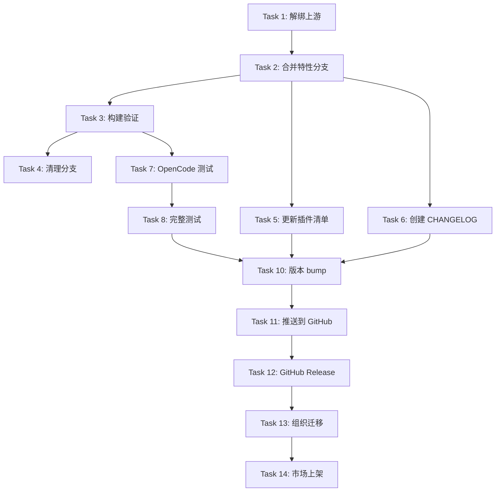

# Implementation Plan: cc-hud 独立维护

## 概述

接管 cc-hud 的独立维护：解绑上游 → 合并特性分支 → 清理分支 → 更新所有权 → 
添加测试 → 发布 v0.6.0 → （未来）迁移组织账号 + 上架插件市场。

## 架构决策

| 决策 | 理由 |
|------|------|
| 合并 feat/opencode-quota → main（fast-forward） | 特性分支仅超前 main 4 commits，无冲突风险 |
| 删除所有特性分支，仅保留 main | 简化分支结构，每特性开新分支 |
| 版本号从 v0.6.0 起跳 | 脱离上游后第一个独立版本 |
| CHANGELOG.md + GitHub Releases 双轨 | 市场展示 + 用户可查 |
| 组织迁移是最后一步 | 避免迁移过程中断发布 |

## 任务列表

---

### Phase 1: 解绑与合并

#### Task 1: 解绑上游 remote

**Description:** 删除 `upstream` remote，确保与原作者仓库完全脱离。

**Acceptance criteria:**
- [ ] `git remote -v` 不再显示 upstream
- [ ] 本地所有 upstream refs 清理干净

**Verification:**
- [ ] `git remote -v` 确认只有 origin

**Dependencies:** 无

**Files likely touched:** 无

**Estimated scope:** XS (1 操作)

---

#### Task 2: 合并 feat/opencode-quota → main

**Description:** 切换到 main，合并 `feat/opencode-quota`。该分支包含 OpenCode Go 订阅配额显示的核心实现（新增 src/opencode.ts，修改 src/index.ts、src/render.ts、src/types.ts，以及对应的编译产物）。

**Acceptance criteria:**
- [ ] main 包含 feat/opencode-quota 的所有 4 个 commit
- [ ] `git log main --oneline` 显示 f8e8caf 在历史中

**Verification:**
- [ ] `git diff main..feat/opencode-quota` 输出为空（已合并无差异）

**Dependencies:** Task 1

**Files likely touched:** 无（纯 git 操作）

**Estimated scope:** XS

---

#### Task 3: 安装依赖 + 构建验证

**Description:** 在合并后的 main 上执行 `npm install` 和 `npm run build`，确保 TypeScript 编译通过，dist/ 产物与 src/ 一致。

**Acceptance criteria:**
- [ ] `npm run build` 退出码 0
- [ ] `dist/opencode.js` 存在且非空

**Verification:**
- [ ] Build succeeds: `npm run build`

**Dependencies:** Task 2

**Files likely touched:** 无

**Estimated scope:** XS

---

#### Checkpoint: Phase 1
- [ ] `git remote -v` 仅显示 origin
- [ ] main 已包含 OpenCode 特性
- [ ] `npm run build` 通过
- [ ] 确认后继续 Phase 2

---

### Phase 2: 清理与配置

#### Task 4: 清理本地和远程分支

**Description:** 删除已合并的特性分支。本地删除 `feat/opencode-quota` 和 `docs/cc-hud-extra-file-windows`。远程删除 `origin/feat/opencode-quota` 和 `origin/docs/cc-hud-extra-file-windows`。

**Acceptance criteria:**
- [ ] `git branch` 仅显示 main
- [ ] `git branch -r` 仅显示 `origin/main`（和 `origin/HEAD`）

**Verification:**
- [ ] `git branch -a` 确认清理干净

**Dependencies:** Task 2

**Files likely touched:** 无

**Estimated scope:** XS

---

#### Task 5: 更新插件清单所有权

**Description:** 修改 `.claude-plugin/plugin.json` 和 `.claude-plugin/marketplace.json`，将 owner 从 `Water` 改为你的信息，更新 repository URL 指向你的 fork。

**Changes needed:**
- `plugin.json`: `author.name` → `熊崽`、`homepage` → `https://github.com/wyouwd1/cc-hud`、`repository` → same
- `marketplace.json`: `owner.name` → `熊崽`

**Acceptance criteria:**
- [ ] plugin.json 不再包含 Water
- [ ] marketplace.json 不再包含 Water
- [ ] 所有 URL 指向 `github.com/wyouwd1/cc-hud`

**Verification:**
- [ ] Read plugin.json 和 marketplace.json 确认

**Dependencies:** 无

**Files likely touched:**
- `.claude-plugin/plugin.json`
- `.claude-plugin/marketplace.json`

**Estimated scope:** XS

---

#### Task 6: 创建 CHANGELOG.md

**Description:** 创建 Keep a Changelog 格式的 CHANGELOG.md，汇总 v0.1.0 到 v0.5.1 的发布历史，以及 v0.6.0 的新变更。从 git log 提取每个版本的内容。

**Acceptance criteria:**
- [ ] CHANGELOG.md 位于项目根目录
- [ ] 格式遵循 Keep a Changelog（反向时间序）
- [ ] 包含所有 17 个 tag 版本
- [ ] v0.6.0 入口包含 OpenCode 配额显示、独立维护切换

**Verification:**
- [ ] 文件可读，格式正确

**Dependencies:** 无（需要了解 git log，但不依赖代码修改）

**Files likely touched:**
- `CHANGELOG.md`

**Estimated scope:** S

---

#### Checkpoint: Phase 2
- [ ] 只剩 main 分支
- [ ] 插件信息归你所有
- [ ] CHANGELOG.md 已建立
- [ ] 确认后继续 Phase 3

---

### Phase 3: 测试与文档

#### Task 7: 编写 OpenCode 单元测试

**Description:** 参考 `tests/mmx.test.ts` 的测试模式（隔离检测、HTML 解析、错误降级、缓存），为 `src/opencode.ts` 编写完整测试。覆盖以下维度：
- **隔离检测**: 无 OPENCODE_AUTH 时返回 null，不发起 fetch
- **HTML 解析**: 真实形状的 HTML 片段解析出正确的 rolling/weekly/monthly 百分比和重置时间
- **null 值跳过**: monthlyUsage:null 的场景
- **错误降级**: HTTP 错误、网络超时、解析失败时返回 null
- **缓存**: 5 分钟内命中缓存，失败时回退 stale cache

**Acceptance criteria:**
- [ ] `tests/opencode.test.ts` 存在
- [ ] 所有测试用例通过
- [ ] 测试覆盖 4 个维度（隔离、解析、降级、缓存）

**Verification:**
- [ ] `node --test tests/opencode.test.ts` 全部通过

**Dependencies:** Task 3（需要编译后的 dist/opencode.js）

**Files likely touched:**
- `tests/opencode.test.ts`

**Estimated scope:** M (~150 行测试代码)

---

#### Task 8: 完整测试套件验证

**Description:** 运行全部测试（model、render、mmx、glm、opencode、launcher），确保所有测试通过。

**Acceptance criteria:**
- [ ] `npm test` 退出码 0
- [ ] 所有测试用例通过

**Verification:**
- [ ] `npm test` 全部通过

**Dependencies:** Task 7

**Files likely touched:** 无

**Estimated scope:** XS

---

#### Task 9: 更新 README

**Description:** 更新 README 中的维护信息：修改作者、仓库链接、安装来源为你的 fork。在文档中注明独立维护状态。

**Acceptance criteria:**
- [ ] README 中的作者信息更新
- [ ] README 中的仓库链接指向你的 fork
- [ ] 提及独立维护状态

**Verification:**
- [ ] 阅读 README 确认

**Dependencies:** 无

**Files likely touched:**
- `README.md`

**Estimated scope:** XS

---

#### Checkpoint: Phase 3
- [ ] `npm test` 全部通过（含新 OpenCode 测试）
- [ ] README 已更新
- [ ] 确认后进入 Phase 4 发布

---

### Phase 4: 发布 v0.6.0

#### Task 10: 版本 bump + 打 tag

**Description:** 使用 `npm version` 将版本号从 0.5.1 升级到 0.6.0，自动更新 package.json 并创建 annotated git tag。同步更新 plugin.json 和 marketplace.json 中的 version 字段。

**Acceptance criteria:**
- [ ] `package.json` 中 version = "0.6.0"
- [ ] `plugin.json` 中 version = "0.6.0"
- [ ] `marketplace.json` 中 metadata.version = "0.6.0"
- [ ] `git tag -l` 包含 v0.6.0

**Verification:**
- [ ] `npm version` dry-run 确认一切正常后执行

**Dependencies:** Task 8

**Files likely touched:**
- `package.json`
- `package-lock.json`
- `.claude-plugin/plugin.json`
- `.claude-plugin/marketplace.json`

**Estimated scope:** XS

---

#### Task 11: 推送到 GitHub

**Description:** 将 main 分支和 v0.6.0 tag 推送到 origin。

**Acceptance criteria:**
- [ ] `git push origin main` 成功
- [ ] `git push origin v0.6.0` 成功

**Verification:**
- [ ] GitHub 上可见新的提交和 tag

**Dependencies:** Task 10

**Files likely touched:** 无

**Estimated scope:** XS

---

#### Task 12: 创建 GitHub Release

**Description:** 使用 `gh release create v0.6.0` 创建 Release，引用 CHANGELOG.md 中的 v0.6.0 内容。

**Acceptance criteria:**
- [ ] GitHub 上 可见 Release v0.6.0
- [ ] Release 描述与 CHANGELOG 一致

**Verification:**
- [ ] `gh release view v0.6.0` 可查看

**Dependencies:** Task 11

**Files likely touched:** 无

**Estimated scope:** XS

---

#### Checkpoint: Phase 4
- [ ] GitHub 上 main 分支最新
- [ ] v0.6.0 tag 和 Release 已发布
- [ ] 独立维护管线建立完毕

---

### Phase 5 (Future): 组织迁移

#### Task 13: 迁移仓库到 GitHub 组织

**Description:** 在 GitHub 创建组织账号，将 repo 从 `wyouwd1/cc-hud` 迁移到组织下。更新所有 remote URL。

**Acceptance criteria:**
- [ ] 仓库在组织账号下
- [ ] 本地 remote URL 指向新地址
- [ ] 旧仓库有 README 跳转提示

**Verification:**
- [ ] `git remote -v` 指向组织 repo

**Dependencies:** Task 12

**Files likely touched:**
- `.claude-plugin/plugin.json`
- `.claude-plugin/marketplace.json`
- `README.md`
- `commands/setup.md`

**Estimated scope:** M

---

#### Task 14: 提交 Claude Code 插件市场审核

**Description:** 在组织迁移后，将 cc-hud 提交到 Claude Code 插件市场。确保 plugin.json 和 marketplace.json 的组织信息正确。

**Acceptance criteria:**
- [ ] 插件在 Claude Code 市场可见
- [ ] `claude plugins:install cc-hud` 可用

**Verification:**
- [ ] 在市场搜索到 cc-hud

**Dependencies:** Task 13

**Files likely touched:** 无

**Estimated scope:** S

---

## 依赖图

## 风险与缓解

| 风险 | 影响 | 缓解 |
|------|------|------|
| 合并冲突 | Medium | feat 分支仅 4 commits 超前，diff 干净，冲突概率极低 |
| OpenCode HTML 结构变化 | Medium | 测试覆盖典型 HTML 结构，解析失败静默降级 |
| GitHub Release 权限不足 | Low | 确认 gh auth status |
| 市场审核不通过 | Low | 先独立维护，条件成熟后再提交 |

## 开放问题

- 无（所有决策已在 spec 中确认）
