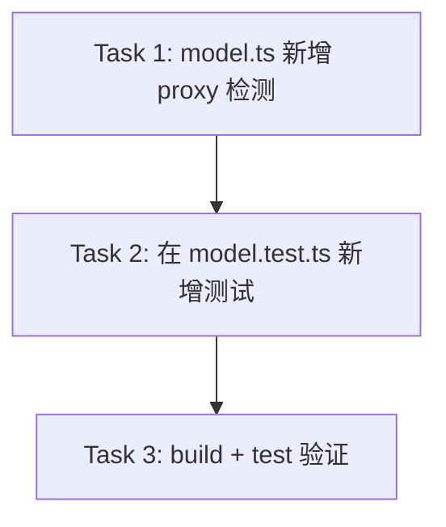

# Implementation Plan: 自定义代理模型名正确显示

## 概述

当用户通过 cc-switch 等本地代理（`ANTHROPIC_BASE_URL` 指向 `127.0.0.1`/`localhost`）使用自定义模型时，Claude Code 的 stdin JSON 中 `model.id` 仍为 `claude-opus-4-8[1M]`，导致 cc-hud 错误显示为「Opus 4.8」。

**解决**: 检测到本地代理时，用 `ANTHROPIC_DEFAULT_OPUS_MODEL_NAME`（如 `deepseek-v4-flash`）替代模型名，经 `tryParse` 美化后展示。

## 现有可复用代码

| 函数 | 文件 | 复用方式 |
|------|------|---------|
| `tryParse(raw)` | `src/model.ts` | 美化 env 值（`deepseek-v4-flash` → `DeepSeek V4 Flash`） |
| `shortModelName()` | `src/model.ts` | 修改入口，内部优先走 proxy 检测 |
| `npm run build` | `package.json` | `tsc` 编译 TS→JS |
| `npm test` | `package.json` | `build && node --test`，测试目标为 `dist/` |
| `node:test` + `node:assert/strict` | 测试惯例 | 新增测试用例沿用此模式 |

## 依赖图



3 个任务，无并行依赖。

## 任务列表

---

### Phase 1: 核心逻辑

#### Task 1: 在 `src/model.ts` 中新增本地代理检测与模型名覆盖

**涉及文件:** `src/model.ts`

**改动点:**

1. 新增内部函数 `isLocalProxy(): boolean`
   - 读 `process.env.ANTHROPIC_BASE_URL`
   - 含 `127.0.0.1` 或 `localhost` 返回 true

2. 新增内部函数 `proxyModelName(): string | null`
   - 非本地代理 → 返回 null
   - 代理模式 + `ANTHROPIC_DEFAULT_OPUS_MODEL_NAME` 未设置/空串 → 返回 null
   - 代理模式 + env 有值 → 经 `tryParse` 美化后返回（匹配到 deepseek/glm/mm 模式则美化，否则返回原始值）

3. 修改 `shortModelName()` 函数
   - 在解析 stdin 之前，先调用 `proxyModelName()`
   - 有值 → 直接从 id 提取 variant，组装 ModelName 返回
   - 无值 → 走原逻辑

**伪代码:**

```typescript
const PROXY_HOSTS = ['127.0.0.1', 'localhost'];

function isLocalProxy(): boolean {
  const base = process.env.ANTHROPIC_BASE_URL ?? '';
  return PROXY_HOSTS.some(h => base.includes(h));
}

function proxyModelName(): string | null {
  if (!isLocalProxy()) return null;
  const raw = process.env.ANTHROPIC_DEFAULT_OPUS_MODEL_NAME;
  if (!raw) return null;
  const parsed = tryParse(raw);
  if (parsed) return parsed.name;
  return raw.trim() || null;
}

export function shortModelName(displayName?: string, id?: string): ModelName {
  // 1) 本地代理 → 用 ANTHROPIC_DEFAULT_OPUS_MODEL_NAME
  const proxyName = proxyModelName();
  if (proxyName) {
    const variant = id ? tryParse(id)?.variant ?? null : null;
    return { name: proxyName, variant };
  }
  // 2) 原逻辑保持不变
  if (id) {
    const r = tryParse(id);
    if (r) return r;
  }
  if (displayName) {
    const r = tryParse(displayName);
    if (r) return r;
    const stripped = displayName.replace(/\s*\(.*?\)\s*/g, '').trim();
    if (stripped) return { name: stripped, variant: null };
  }
  return { name: 'Claude', variant: null };
}
```

**改动量:** ~25 行新增
**影响范围:** `shortModelName()` 行为变更（仅本地代理场景）

**Acceptance criteria:**
- [ ] `isLocalProxy()` 对 `127.0.0.1:15721` 返回 true，对 `https://api.anthropic.com` 返回 false
- [ ] `proxyModelName()` 在非代理模式返回 null
- [ ] `proxyModelName()` 在代理模式 + env 不存在返回 null
- [ ] `proxyModelName()` 在代理模式 + env 的 `deepseek-v4-flash` 返回 `DeepSeek V4 Flash`
- [ ] `shortModelName()` 在代理模式下返回值包含正确 variant（从 id 提取）
- [ ] 直连用户行为零变化

---

### Phase 2: 测试

#### Task 2: 在 `tests/model.test.ts` 中新增代理模式测试

**涉及文件:** `tests/model.test.ts`

**测试内容（添加在现有 describe 末尾）:**

```
describe('proxy model override', () => {
  it('reads model name from ANTHROPIC_DEFAULT_OPUS_MODEL_NAME under local proxy')
  it('uses variant from model id even when proxy name overrides')
  it('ignores env var when not under local proxy')
  it('ignores empty env var under local proxy')
  it('beautifies deepseek name via tryParse')
  it('returns raw env value when tryParse does not match')
  it('falls through to normal logic when proxy env var is not set')
})
```

**Env mock 策略:**
- 使用 `beforeEach` / `afterEach` 保存/恢复 `process.env`
- 设置 `ANTHROPIC_BASE_URL=http://127.0.0.1:15721` + `ANTHROPIC_DEFAULT_OPUS_MODEL_NAME=deepseek-v4-flash` 模拟代理场景
- 设置 `ANTHROPIC_BASE_URL=https://api.anthropic.com` 模拟直连场景

**注意:** 测试导入 `../dist/model.js`，需先 `npm run build`。`npm test` 已自动包含 build 步骤。

**改动量:** ~50 行新增
**主要风险:** env 是全局可变状态，测试间需隔离

**Acceptance criteria:**
- [ ] 所有新测试通过
- [ ] 现有测试不受影响（env 保存在 proxy 场景之外不污染）
- [ ] 测试间 env 完全隔离

---

### Phase 3: 验证

#### Task 3: 编译 + 全量测试

**命令:** `npm test`（等价于 `tsc && node --test`）

**验证点:**
- `tsc` 无类型/编译错误
- 测试套件全部通过（含现有 27 个测试 + 新增代理测试）
- 全部测试名称打印输出，无 skip/fail

**Acceptance criteria:**
- [ ] 退出码 0
- [ ] 所有测试通过
- [ ] 无 TypeScript 编译错误

---

## 风险与缓解

| 风险 | 影响 | 缓解 |
|------|------|------|
| env 变量测试间泄漏 | 测试失败 | `beforeEach` 完整保存/恢复 `process.env` |
| `ANTHROPIC_DEFAULT_OPUS_MODEL_NAME` 是较新的 Claude Code 变量 | 某些旧版本未定义 | 作为可选检测，未设置时正常回退 |
| BASE_URL 中意外的 `localhost` 字符串 | 非代理场景也触发覆盖 | 只有同时设置了 `ANTHROPIC_DEFAULT_OPUS_MODEL_NAME` 才生效 |

## 开放问题

无。需求已在 SPEC.md 中完全明确。
